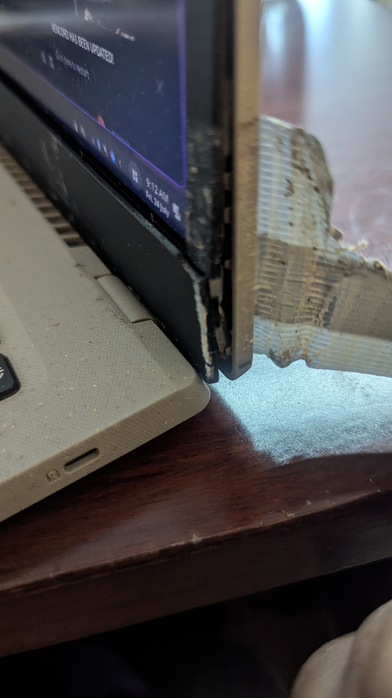
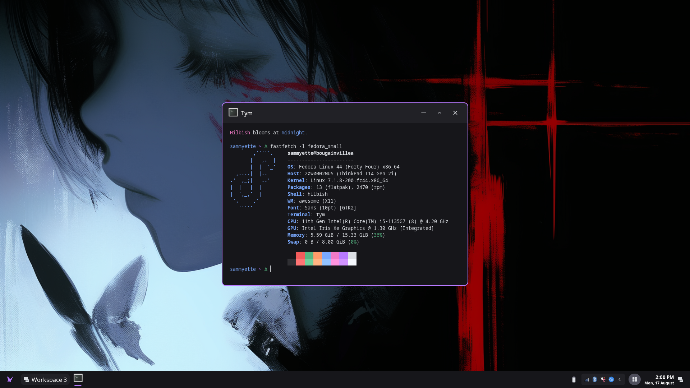

This website and my blog are so out of date that you all don't even know about
the problems my Acer Aspire Vero has. I'll have to get into that first before I
even talk about the real topic of this blog post.

# Acer Laptop Backstory
Around 3 years ago I got a laptop, to upgrade from my aging HP "laptop," in quotes
because that thing was not suited to be on a lap anymore. The Acer served its time
*decently* to say the least.

The earliest problem with it was the battery. In about a year or two span I completely
cooked the battery on the thing. The laptop was my only computing device
besides a phone. If I want to do school work, game, anything, it had to be on 
the laptop. This means that I had it on the charger practically 24/7. Being
a cautious owner of a new laptop I thought this would be fine for the battery.
I mean, websites told me that, various people on Discord told me that modern
laptops can handle being on the charger constantly. "It will directly power the
laptop without straining the battery," so they say. Turns out that was a LIE!

The battery was absolutely cooked. I bought a new one, and.. didn't learn
my lesson apparently, but the second battery genuinely started rapidly downgrading
about a month before I got the Thinkpad. I planned to sell this laptop so that'd be
quite bad for me and the new owner. Seems they don't mind though, I sold it and I
haven't gotten a complaint. Either Windows just handles a shitty battery better,
or they coped with keeping it on the charger. I don't know!

The second problem was the thermals. This laptop was constantly running loud
and hot. Those fans were running at their max speed and they were being
useless while doing that. I could be doing quite literally nothing besides light
coding and the CPU was at ~60c or higher, and it was audibly loud while cooling that
CPU.

The third, and probably biggest problem, was the hinge. Not the hinge exactly,
but the area around the hinge. The laptop's bezels are plastic. The entire
laptop is plastic. The whole thing behind the laptop was being built with recycled
plastic, but due to my usage, and to the weak plastic, the right side of the laptop
broke.

As you can see, I had to duct tape it to be able to open and close the laptop.
Otherwise the hinge wouldn't move and the laptop would not be able to open. This
event influenced my requirements for a replacement laptop:

1. It needs to be cheap. I live in the Caribbean. USD to XCD is almost 3x (1USD = 2.70XCD).
2. It MUST NOT be built with plastic.
3. Needs to be good/decent on Linux.
4. The specs should still be good. 16GB RAM, 512GB SSD, preferably similar CPU or close
in generation (11th Gen Intel)

# Enter.. A Thinkpad
Thinkpads fit these criteria perfectly. A brand with practically a cult following,
especially among Linux users. They have good build quality, yet are cheap used.
I found a couple listings on Ebay but I went with a T14 Gen 2 that looked *clean,*
priced at $175, free shipping.

It was impressive for a used laptop. Just had some dents on the body,
but I figured I can cover it with some stickers I am planning to put on my laptop anyway. 

That's my AwesomeWM setup running on said Thinkpad. Awesome (hehe) am I right? I got
a good, working laptop. So why is this blog post named how it is?

# Story of my sad life
Let me give you a run down of my first DAY with this laptop. I literally got this
a week ago as of writing this blog post. I have been waiting 2 weeks for this laptop.
It has to ship from the seller to MyUS, which took a week, then had to ship from MyUS
in Florida to me, ~32USD. That took about 3 days I think, it arrived on Friday.
Can't pick it up on Saturday, so Monday and Tuesday it is! Yay new laptop!!!!

But wait.. its August!!! August means carnival here, and that Monday and Tuesday
was a public holiday. Oh well. Ill just get it Wednesday. That day before work
I sold the Acer to a friend, then had to go to FedEx to pick it up and also pay customs.
That took an hour and a half by the way but whatever. I get to work
and boot my cool new Thinkpad T14. Plug in my Ventoy USB with a Fedora 43 ISO on it.
Install Fedora, upgrade to 44 on tethered USB because apparently the blobs for my hardware
weren't included or something, but it was on the installer... ???? No big deal.
I install Fedora with my AwesomeWM setup and programs and get along with my work day.
Admittedly I didn't do actual work on that day but that doesn't matter. A work day
is over and I get home. I used the laptop until the battery ran out, and put it to charge.
Then I went to sleep.

## It's Dead.
Fast forward to the next day. Morning, I wake up. While I am eating I just turn on my
laptop so I can install some things at home so I don't have to do it at work. Press
the power button. Thinkpad fans spin at max speed... then off.

wtf wtf wtf it's been less than 24 hours and it's dead wtf is happening I need my
laptop to work today.

I have to search "thinkpad t14 not turning on" and I saw some Reddit posts,
I go to Lenovo's AI assistant thing and it says I may have to send it in for repair.
I ask Gemini for solutions and none of those 3 options help me. Oh well,
guess I'll just cope.

Luckily for me my boss wasn't in and I had to show something before I could proceed
with what I was working on. I could only play on my 2DS XL for the day and scroll on my phone.
With only 2 hours left in the work day I though "let me try turning it on" and surprisingly
it worked?????

I genuinely hit this pose when it booted up. HEY AT LEAST IT WORKS. I spent the last 2 hours
of the work day on my laptop tinkering with it, mainly to get good battery life.
When its time to leave work, I just closed it, as people usually do with a laptop
when they, you know, don't want to shut it down because it might not start up anymore,
that is most definitely a common situation.

Imagine my feeling of despair when I get home, open the laptop, and it just
shuts off. Huh? Why did it shut off? And of course it doesn't turn on. It does the
same thing of spinning the fans and then doing nothing.

## Some Discoveries
While fiddling with it and trying to get it to boot on the first morning I
had it, I had figured out a couple things.

One was that when this event occured (powering it on, spinning fans, then nothing)
if my charger was connected, the charging LED stays on. Even when I unplug it, the LED stays on,
and it's not supposed to do that. When I hit the reset switch on the bottom of the laptop,
it turns off, because that switch disconnects the battery. If I *didn't* have the charger
connected, and this event occured, the LED would *not* turn on.

Two was that the laptop wasn't entirely dead. Obviously, it managed to turn on by
chance at work, but it also turned on after messing with it when I got home. If I
connected it to the charger, then left it, there would be a **chance** that it came on again.
It's not very consistent and I don't know how long I am supposed to leave it on charge.

Some questioning with AI and Google searching reveals that I should try checking the
voltage of the CMOS battery and just try taking out the battery altogether, but I don't
have a good screwdriver so I am unable to open the laptop to try anything else.

Three is that I basically can't let this thing shut off. If I leave it on
Linux S3 sleep it might randomly shut off when I try to wake it from sleep.
If it's in s2idle it might run out of battery. It only lasts close to 24 hours
on a charge and I don't really use my laptop on the weekends.
I have a PC now that I use when I am at home.

The laptop is still perfectly capable and usable WHEN IT CAN BOOT.
It is highly annoying that I have to do a dance of:
- Power it on
- Fans spin, no boot
- Reset pin hole
- Leave it for a bit
- Repeat the cycle in hopes it turns on

I surely thought an update to the BIOS and EC would fit it but it didn't.

# In Conclusion
My first experience with a Thinkpad has been very sour. I haven't even mentioned
that the display colors suck, and I don't know how to fix that, if it's even fixable.
My TCL has nicer and more vibrant colors. This display looks washed. The fingerprint's
nice I guess.. the one on the Acer wouldn't play nice with fprintd.

I sold the Acer for 700 XCD. Considering the specs, it's still a capable laptop,
not minding the duct tape on the right side and the degrading battery that only
has like 10% capacity when I checked it via `upower`... oh and the Tab and W keys not
working. They agreed at that price with all those issues, so I feel fine about it.

Today I bought an X13 Yoga Gen 2 as a replacement. Sure hope this one doesn't have the
same issue or that will be absolutely insane. It's just the best condition laptop at the price
and specs I wanted. It was a bid actually, and I managed to win the bid. The last
time (first time ever) I made a bid on Ebay was for a PS3 and I got outbid BADLY.
The price practically tripled in the last couple seconds.

What am I going to do with this T14? I have no idea. I guess it'll just rot away in my
room, or I might manage to sell it "as parts" and I might even still get it for a decent price,
considering the only issue is that it doesn't turn on sometimes. I got a partial refund
from the Ebay seller so I'm not entirely salty but I am still salty
because it's $100 refund from $175. That refund doesn't include the price to ship it
to me and to clear it at customs. I'll make another post with an update to my laptop
situation when the Yoga gets to me in probably 2 weeks.
